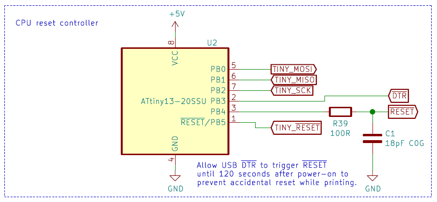

*Failed 3d-prints hate this schematic. Eleminate microcontroller resets with this one weird trick.*

This schematic is part of another project: a replacement 3d-printer motherboard. Connecting USB midway into a 3d-print results into a failed print because the microcontroller is automatically reset by flashing DTR.

So I devised this simple circuit. An ATTINY13 microcontroller with simple programming: passthrough DTR pulses to ̅RESET upto 120 seconds after poweron. In that way you can still update the firmware, but no unwanted resets anymore.

Flash the hex-file using your favorite programmer. Use these fuse settings:

LOW: 0x7A\
HIGH: 0xFB\
LOCK: 0xFF

